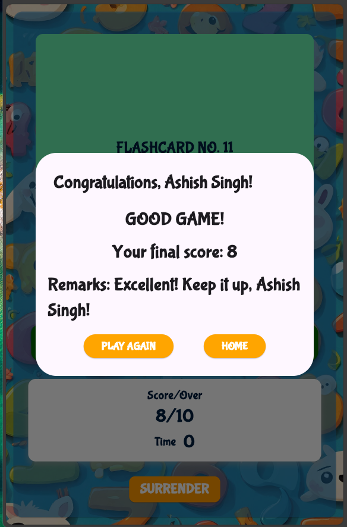

# Math Challenge App

A Flutter-based cross-platform mobile app designed to help users improve their math skills through fun and interactive challenges. This project is developed using **Flutter SDK 3.5.4** and supports Android, iOS, Web, Windows, macOS, and Linux.

## Features
- Generate random math problems for users to solve.
- Different game modes for a variety of challenges.
- Track scores and results for each session.
- User-friendly interface for easy navigation.
- Multi-platform support.

## Table of Contents
- [Installation](#installation)
- [Usage](#usage)
- [Screenshots](#screenshots)
- [Project Structure](#project-structure)

## Installation

### Prerequisites
- Flutter SDK (version 3.5.4): [Install Flutter](https://flutter.dev/docs/get-started/install)
- Git: [Install Git](https://git-scm.com/book/en/v2/Getting-Started-Installing-Git)
- IDE/Text Editor (e.g., VS Code, Android Studio)

### Steps to Setup
1. Clone the repository:
   ```bash
   git clone https://github.com/AshishBytes/math_challenge_app.git
   cd math_challenge_app
   ```

2. Install dependencies:
   ```bash
   flutter pub get
   ```

3. Run the app:
   ```bash
   flutter run
   ```

4. To build for a specific platform, use:
   - **Android**: `flutter build apk`
   - **iOS**: `flutter build ios`
   - **Web**: `flutter build web`
   - **Windows**: `flutter build windows`
   - **macOS**: `flutter build macos`
   - **Linux**: `flutter build linux`

## Screenshots

### Welcome Page


### Game Mode Page


### Game Page


### Results Page


### Variety Page


## Project Structure

```plaintext
lib/
├── flashcard_generator.dart  # Logic for generating flashcards
├── game_info.dart            # Game information and data
├── game_mode_page.dart       # Page where users select game mode
├── game_page.dart            # Main page where the game happens
├── main.dart                 # Entry point of the app
├── results_page.dart         # Page for displaying results
├── variety_page.dart         # Page for selecting game variety
├── welcome_page.dart         # Welcome page for the app
assets/
├── images/                   # Image assets for app screens
│   ├── welcome_page.png      # Screenshot for welcome page
│   ├── game_mode_page.png    # Screenshot for game mode page
│   ├── game_page.png         # Screenshot for game page
│   ├── results_page.png      # Screenshot for results page
│   └── variety_page.png      # Screenshot for variety page
└── fonts/                    # Font files (if any)
    └── custom_font.ttf       # Custom font for the app
```

## Usage
1. Open the app on your device/emulator.
2. Choose a game mode and start solving math problems.
3. Track your progress and challenge yourself with different problem varieties.